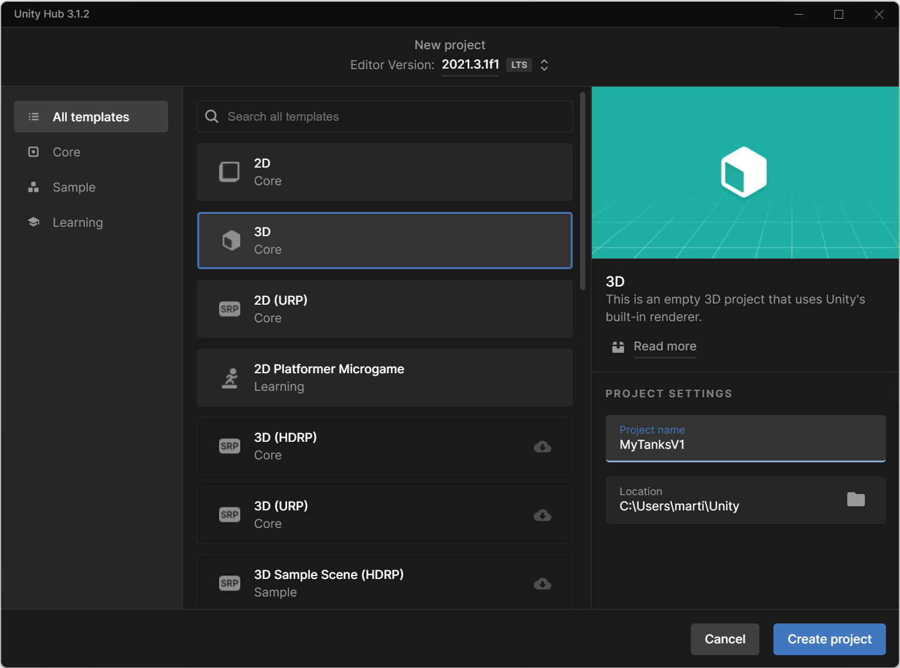
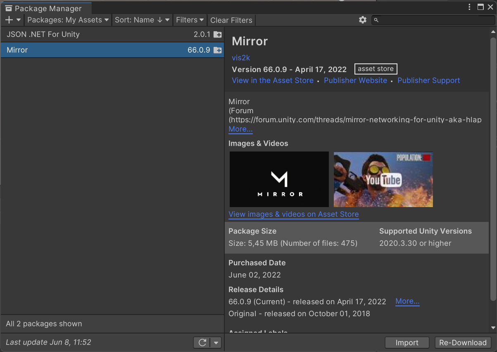
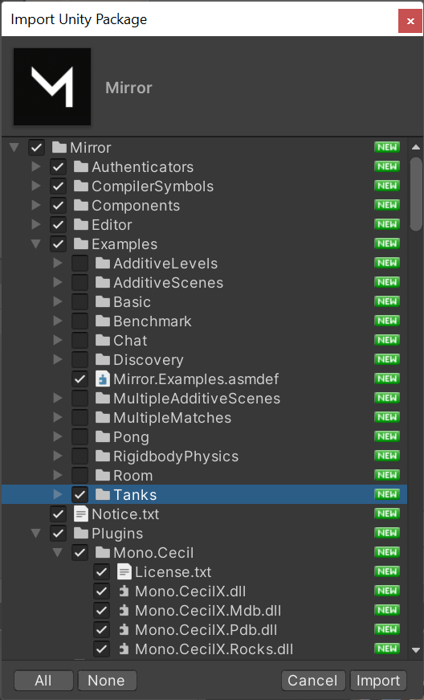
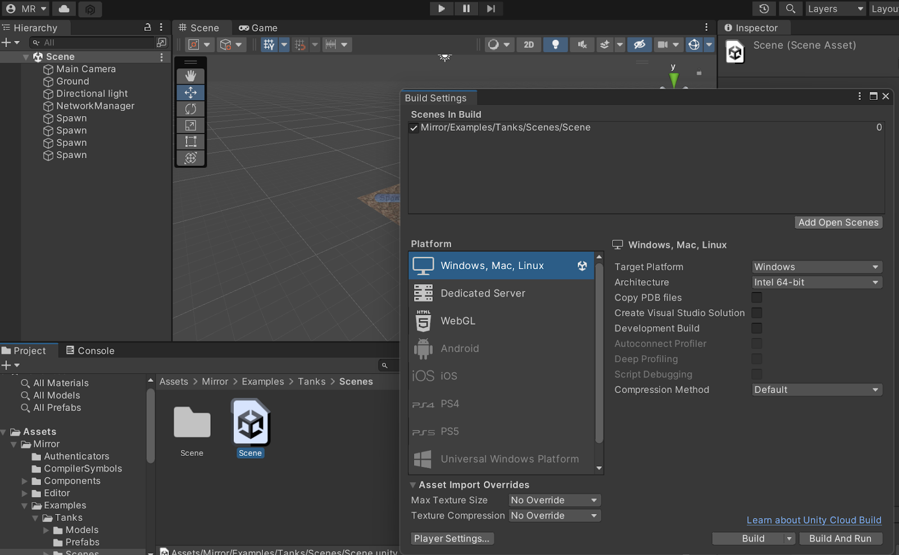
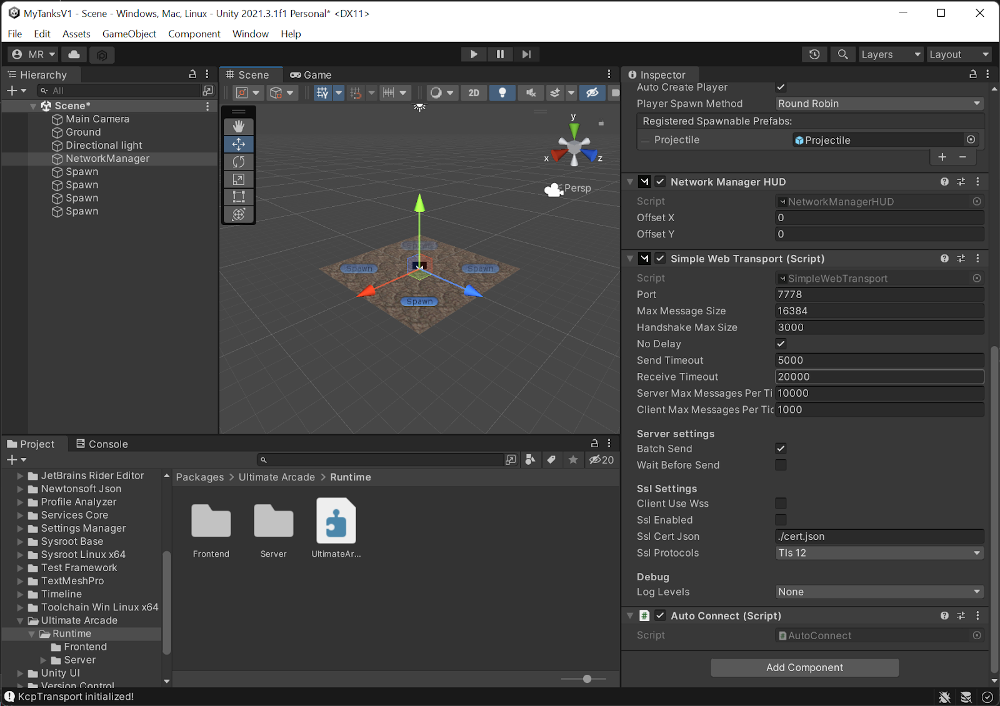
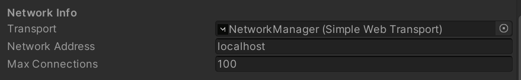
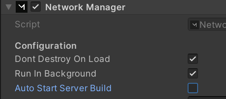
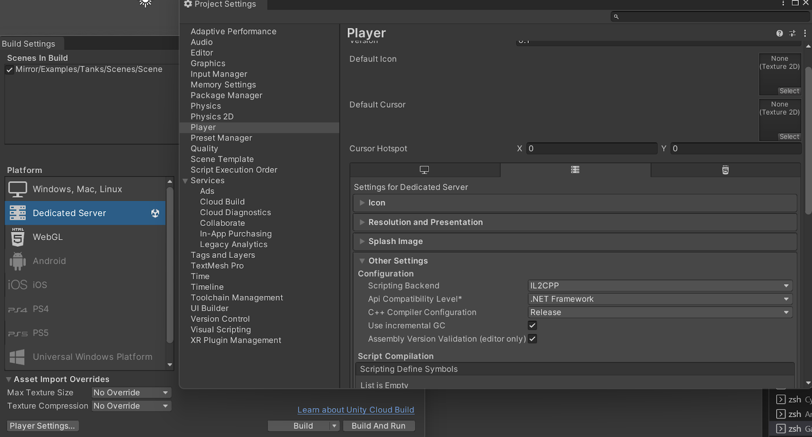

# Unity Example Game Integration

Next, we'll show you how to make a Unity game work with the Ultimate Arcade.

We'll use [Mirror](https://mirror-networking.gitbook.io/), because it’s awesome and open-source but you can use any framework that you want (or none at all) to implement client-server networking.

Another reason is that they bring a few nice examples and we don't want to focus building the game itself.

The full code can be found on [github.com/UltimateTournament/UnityExampleGame](https://github.com/UltimateTournament/UnityExampleGame).

## Step by Step

### Create a new game
We're using Unity version 2021.3



### Install Mirror

First add it to your account from the [Unity Asset Store](https://assetstore.unity.com/packages/tools/network/mirror-129321).

Next, import it into your project:



When importing, remove all examples, but the "Tanks" example. We'll make it the easiest high-score game ever! You have 300 seconds to fire 5 shots. Whoever has the most time left after finishing this "challenge" gets the highest score! Exciting!



Now move the example to your root folder so you don’t get any namespace issues when we start modifying the code.

### Install the Ultimate Arcade SDK

In the package manager add our SDK via its Git URL:
`https://github.com/UltimateTournament/ArcadeUnitySDK.git`

### Open scene and add to build

Now that all the external code is there, lets setup our project correctly.

Open the scene, then go to the build settings and click "Add Open Scene" and remove the empty scene that Unity initially created.



### Configuring the network

The game will run on the web and browsers only support WebSockets, so go to the `Network Manager`, remove the `KCP Transport` and add a `Simple Web Transport` script.




Ensure to update the `Transport` reference in the `Network Manager` as well:



We need to automatically connect but only after the SDK has finished its magic. Therefore disable its own auto-start:



And add the SDK's `Auto Connect` script as a new component to the `Network Manager`.

### Adapting the game

Ideally, you should only need very few changes to your game. They boil down to

#### Use the fixed random seed

Every player of the same leaderboard should get the same level, enemy behavior etc, so if you are using randomness in your game, make sure to use the seed found in `AutoConnect.RandomSeed`.

#### Get the player token from client

The frontend needs to get the matchmaking token from the Arcade and send it to the server.

We can get it via `ExternalScriptBehavior.Token()` and send it to the server with a Mirror `[Command]`.

#### Activate the player session

You need to activate the player's session with the provided token with `UltimateArcadeGameServerAPI.ActivatePlayer(...)`. This is neede to ensure the connection is legitimate and gives you information about the player, like their display name.

#### Check win situation on server only

Make sure that the server is authoritative! We'll do this by having another `[Command]`, so the client can't just update the variable with which we count the shots fired.

#### Report score and shutdown server

When the player has finished we call `UltimateArcadeGameServerAPI.ReportPlayerScore(...)` to report their score.

:::note
This is basically the only place that differs between leaderboard games and real-time games. For those you'd call one of these methods: `SettlePlayer`, `DefeatPlayer` or `SelfDefeatPlayer`.
:::

Now that the session has finished we tell the player that the game is over with a `[TargetRpc]` call, so the game client can use `ExternalScriptBehavior.CloseGame()` to close the iframe. After that, we tell the SDK to shutdown the server with `UltimateArcadeGameServerAPI.Shutdown(...)`.

##### Example Code

Below you can see the changes to the `Tank.cs` file. (We skipped over the unchanged parts, but don't remove them)

```cs
using UltimateArcade.Frontend;
using UltimateArcade.Server;
// ...
namespace Mirror.Examples.Tanks
{
    public class Tank : NetworkBehaviour
    {
        //...
        private UltimateArcadeGameServerAPI serverApi;
        private UltimateArcadeGameClientAPI clientApi;
        private DateTime joinTime;
        private int shotsFired = 0;
        private string token;

        private void Start()
        {
            if (base.isServer)
            {
                this.serverApi = new UltimateArcadeGameServerAPI();
                AutoConnect.OnServerReady += AutoConnect_OnServerReady;
            }
            else
            {
                var token = ExternalScriptBehavior.Token();
                this.clientApi = new UltimateArcadeGameClientAPI(token, ExternalScriptBehavior.BaseApiServerName());
                InitPlayerCmd(token);
            }
        }
        private void AutoConnect_OnServerReady()
        {
            UADebug.Log("If we would use any randomness, then we would use this seed: " + AutoConnect.RandomSeed);
            // and we would only allow players to join after we setup all randomness
        }
        [Command]
        private void InitPlayerCmd(string token)
        {
            this.joinTime = DateTime.Now;
            this.token = token;
            StartCoroutine(serverApi.ActivatePlayer(token,
                pi => UADebug.Log("player joined: " + pi.DisplayName),
                err => UADebug.Log("ERROR player join. TODO KICK PLAYER: " + err)));
        }
        // this is called on the server
        [Command]
        void CmdFire()
        {
            GameObject projectile = Instantiate(projectilePrefab, projectileMount.position, projectileMount.rotation);
            NetworkServer.Spawn(projectile);
            RpcOnFire();
            this.shotsFired++;
            if (this.shotsFired == 5)
            {
                //TODO player should automatically lose when they take longer than the max time

                // score is time left - a bigger score is always better in the Arcade
                var maxTime = 5 * 60 * 1000;
                var score = maxTime - (DateTime.Now - this.joinTime).Milliseconds;
                StartCoroutine(serverApi.ReportPlayerScore(this.token, score,
                    () =>
                    {
                        UADebug.Log("player score reported");
                        this.ClientGameOver();
                        StartCoroutine(this.serverApi.Shutdown(
                            () => UADebug.Log("Shutdown requested"),
                            err => UADebug.Log("couldn't request shutdown:" + err)
                            )
                        );
                    },
                    err => UADebug.Log("ERROR player join. TODO KICK PLAYER: " + err)));
            }
        }
        [TargetRpc]
        void ClientGameOver()
        {
            ExternalScriptBehavior.CloseGame();
        }
        //...
    }
}
```


### Building the game

We require builds to be self-contained. The easiest way to achive that is to set `Project Settings -> Player Settings -> Scripting Backend` to `IL2CPP`:



Now you can export your game!

For the server select `Dedicated Server` and select `Linux` as the OS. The exported filename must be `LinuxServerBuild.x86_64`.

For the client select `WebGL` and just hit build - the default config should be fine.

And you're DONE! Congrats on integrating your first game into the Arcade!
