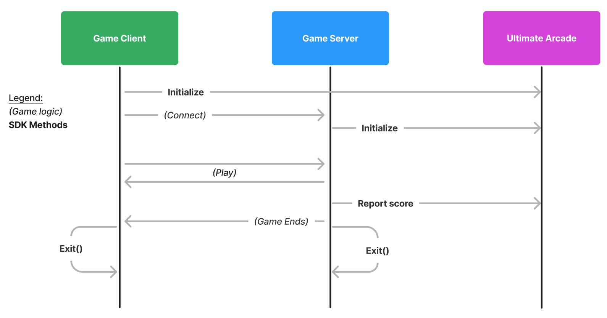

# High-Level Overview

To integrate with the Ultimate Arcade you need to deliver
* the game client
  * a bundle of HTML, JS and assets that runs in the player's browser
* the game server
  * a version of your game (with any needed libraries and assets) that can run on a Linux server

<!-- from https://www.figma.com/file/B6sVE243kTfq9dWLiysrpe/Arcade-Third-Party-Platform?node-id=0%3A1 -->

When a game is started by a player, the following happens:

## Game Client Start

Game clients are loaded in an `iframe`. This isolation allows us to very easily load the game in and out of the UI without breaking the smooth experience players expect from the Ultimate Arcade.

Here is high level flow of how it works:

1. A player clicks play (on a leaderboard/challenge/lobby)
2. A match is found, and a matchmaking token is generated
3. The game client is loaded as an iframe, with the matchmaking token passed in
4. The client SDK initialization extracts the information from the matchmaking token, including on what address to connect to the game server
5. Your game connects to the game server, transfers the matchmaking token, and the player plays the game
6. The server tells the game it has ended and the game tells the SDK
7. The SDK communicates with the parent web page that the game has ended
8. The parent page removes the iframe and replaces it with the game results, and updated player info (tokens, leaderboard position, etc.)

## Game Server Start

Game servers are dynamically provisioned for each game session, meaning they are not reused for multiple plays (except for real-time multiplayer games).

The general flow of a game looks like:

1. Your server starts and you wait until the SDK tells it's ready
2. You start the actual game and ensure to listen for client connections on the port indicated by the `PORT` env var
3. The game client connects and passes the matchmaking token to the server
4. The game server passes the matchmaking token to the SDK to verify the connection, and fetch player information
5. The game is played
6. The game server reports the final score to Ultimate Arcade
7. The server is shut down and tells the SDK to do the same
